# Heinäautomaatti

Raspberry Pi -pohjainen vuorokausiohjain hevosten heinäautomaattien sähkölukkojen ohjaukseen.

Voi ohjata jopa kahdeksan hyllyn sähkölukkoja itsenäisesti, jokaiselle hyllylle oma ajastus. Selainpohjainen hallintaliittymä toimii tietokoneella, tabletilla ja puhelimella — myös suoraan ethernet-kaapelilla ilman WiFiä tai internet-yhteyttä.

---

## Ominaisuudet

- Tuki 1–8 hyllylle, jokaiselle hyllytasolle oma ajastus
- Piezo-summeri varoittaa äänimerkeillä ennen hyllyn avautumista
- Selainpohjainen hallinta (ei komentoriviä käytön aikana)
- Tapahtumien kirjaus lokitiedostoon, luettavissa selaimella
- Toimii itsenäisesti myös ilman internet-yhteyttä
- Hallintayhteys ethernet-kaapelilla suoraan tietokoneesta tai WiFin kautta
- Kevyt ja luotettava — pyörii Raspberry Pi 3B:llä

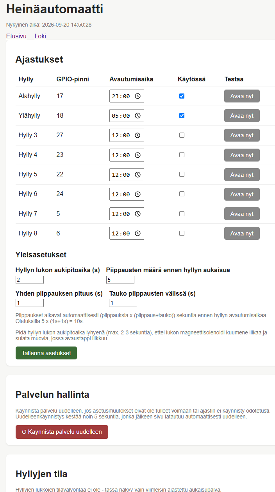

*Kuva ohjaushallinnasta, jossa kaikki 8 hyllyä ovat näkyvissä, mutta vain kaksi käytössä*

---

## Oma toteutukseni

### Ohjauskaappi

Omassa toteutuksessani on käytössä kahden releen lauta: yksi rele ohjaa 8 heinäkaapin alahyllyjä ja toinen rele samojen kaappien ylähyllyjä. Automaateissa on 12V sähkölukko (Amazonista tilattu) per hylly. Sähköt lukoille tulevat 12V moottoripyörän akusta, jota lataa jatkuvasti pieni ylläpitolaturi (CTEC). Myös Raspberry Pi 3B+ saa sähköt samasta akusta auton 12V --> 5V USB-sovittimen kautta.
Jokaisessa 12V lähdössä on ensin sopiva 12V sulake ja vasta sen jälkeen sähkö viedään lukoille tai raspberrylle.

Koko laitteisto on kasattu vanhaan peltiseen lääkekaappiin, jonka saa lukittua.
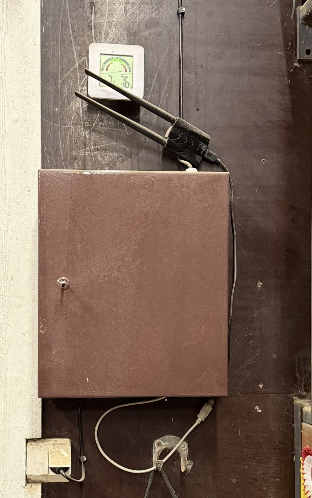
*Ohjauskaapin voi lukita tarvittaessa*

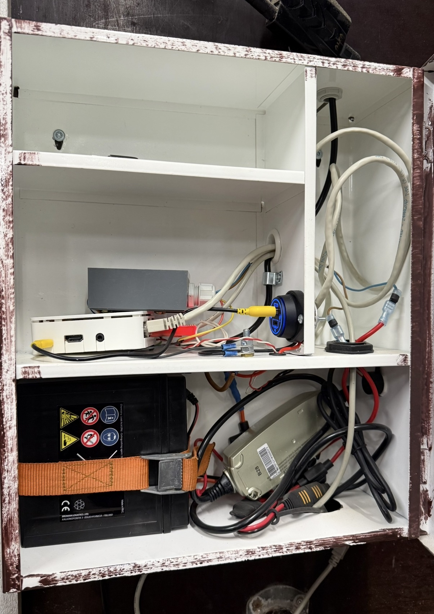
*Ohjauskaappi — akku, laturi, Raspberry Pi, releet ja piezo pakattuna peltiseen kaappiin*

Web-hallinnasta olen piilottanut toistaiseksi ylimääräiset hyllyt. Niihin voisi myöhemmin tehdä esim. ulkoautomaatit tarhoihin tms.
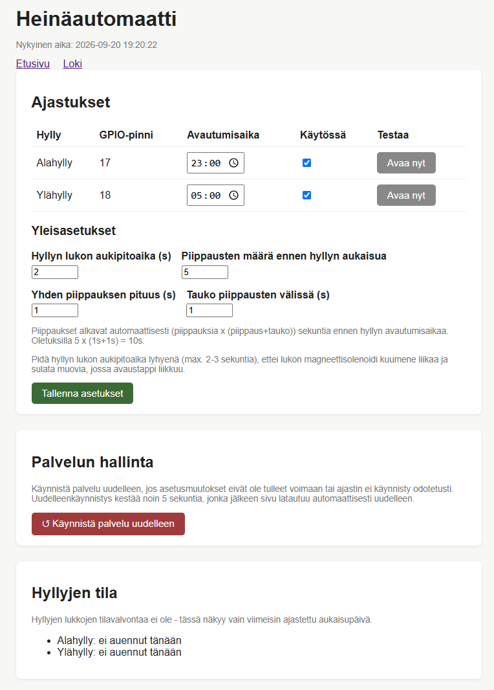<br></br>
*Käytössä oleva näkymä hallintaan, kun ylimääräiset hyllyt on piilotettu*

Toteutuksen etuja:

- Ei vaadi luvallisia (220 vaihtovirta) sähkötöitä (paitsi ylläpitolaturille pitäisi löytyä yksi pistorasia)
- Järjestelmä on täysin immuuni jopa muutaman päivän sähkökatkoille
- Kaapelointi heinäkaapeille on suhteellisen kevyttä. Tarviaan vain yksi - johto ja + johtoja yhtä monta kuin kaapissa on lukkoja (2-hyllyn tapauksessa riittää siten kaapeli, jossa on 3-johdinta. Kolmen hyllyn kaapeissa johtimia tarvittaisiin 4).
- Kaapeleiden vedon voi tehdä itse (12V heikkovirtatoteutus) ja kaappeja voi ketjuttaa helposti.

Periaatteessa toteutuksen voisi tehdä myös ilman sähköliittymää, mutta silti akkua pitää ladata jotenkin silloin tällöin. 

### Heinäautomaatit ja niiden valmistus

Automaattien runko on tehty tavallisesta havuvanerista (joka on edullista). Ovet ja suojaukset kattopellistä. Automaattien alle on hitsattu kaiteet, jotka suojaavat sekä automaattia että hevosta. 

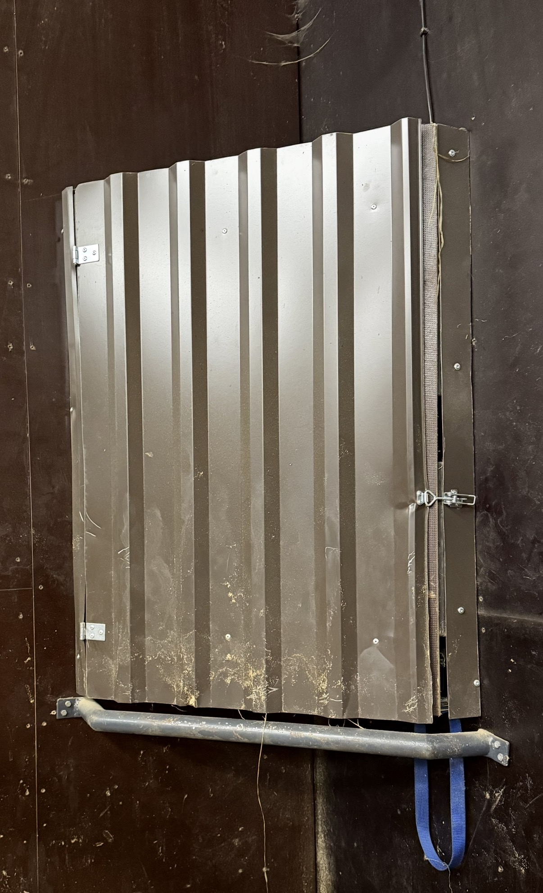

Heinää mahtuu kaappiin arviolta 2-3 kiloa per hylly.
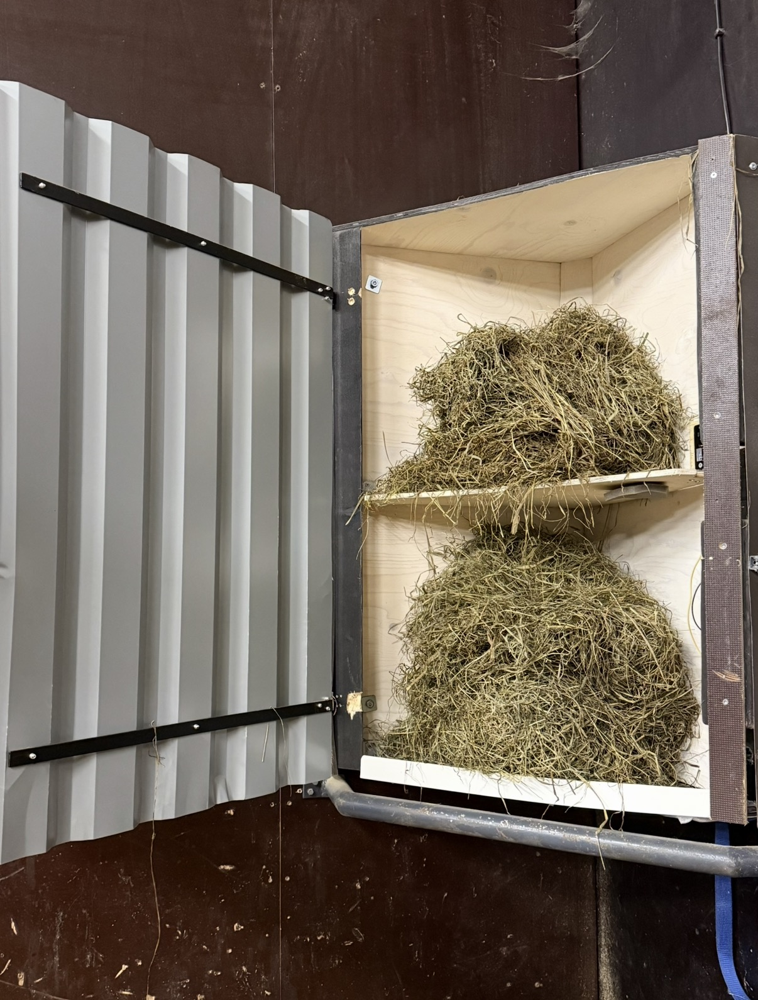

Kaapeissa on sähkölukko / hylly, jotka päästävät heinät putoamaan. Yöheinä jaellaan automaattisesti n. klo 23 ja aamuheinä n. klo 5. Kuuden tunnin lakisääteinen ruokintatiheys täyttyy. 
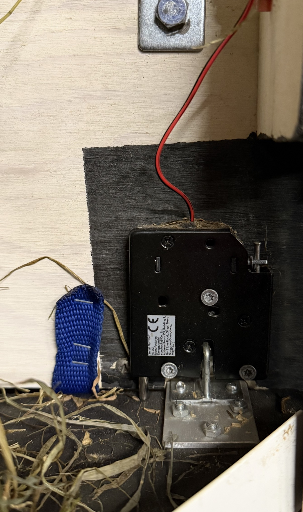
*12V sähkölukko jokaisen hyllyn luona*

[Lue lisää kaapeista](kaapit.md)

---

## Laitteistolista

| Laite | Huomio |
|---|---|
| Raspberry Pi 3B tai 3B+ | Ethernet-portti suositeltava |
| Relekortti (2–8 relettä) | **Aktiivi-LOW** -tyyppi (GPIO LOW = rele vetää) |
| Aktiivinen piezo-summeri | Ei passiivinen — tarkista ennen ostoa |
| 12V sähkölukot | Yksi per hylly |
| Kaapelia releiltä sähkölukoille | Yksi - johdin ja yksi + johdin per hyllytaso |
| Sähkörasioita | Hyllyjen johdotuksen haaroituspisteet |
| 12V akku + ylläpitolaturi | Esim. 9 Ah lyijyakku |
| 12V → 5V USB-sovitin | Auton tyyppi toimii hyvin |
| Ethernet-kaapeli | Tietokone suoraan Raspberry Pi:hin |

> **Vinkki:** Koko ohjauselektroniikan voi pakata esim. kaappiin tai koteloon suojaan.
> Akku, laturi, Raspberry Pi, relekortti ja sulakkeet saa siististi yhteen pakettiin,
> jonka saa lukittua ja josta eth-kaapeli kulkee ulos hallintaa varten. 
> Itse kasasin kaiken vanhaan lääkekaappiin (joita saa mm. tori.fi myynnistä edullisesti).
> Raspberry Pi ja relekortti on syytä koteloida jotenkin.

## Linkkejä mahdollisiin hankintakohteisiin
| Komponentti | linkki |
|---|---|
| RPI 3B+ | [Raspberry Pi 3B+, Amazon.de](https://www.amazon.de/s?k=raspberry+pi+3B) |
| 32GB micro SD | [Raspberry 32 GB SD-kortti, Amazon.de](https://www.amazon.de/s?k=micro-sd+card+32) |
| Releet | [Relekortti (2-8) relettä), Amazon.de](https://www.amazon.de/s?k=raspberry+pi+relay+optocoupler) |
| Magneettilukot | [Magneettilukkoja hyllyihin, Amazon.de](https://www.amazon.de/dp/B07KWMH16C) |
| Piezo | [Aktiivi piezo summeri, Amazon.de](https://www.amazon.de/s?k=active+piezo+buzzer) |
| Akku 12V 9Ah | [Akku Motonetistä](https://www.motonet.fi/tuote/fulbat-agm-12-v-9-ah?product=90-00698)|
| Ylläpitolaturi | [Ylläpitolaturi Motonetistä](https://www.motonet.fi/haku?q=yll%C3%A4pitolaturi%2012V) |
| Auton USB sovitin 12V --> 5V  | [USB-sovitin Motonetistä](https://www.motonet.fi/tuote/four-vedenpitava-usb-pistorasia-12-24-v?product=65-01122) |
| Sulakerasiat | [Sulakerasioita](https://www.motonet.fi/tuote/laattasulakerasia-gm-maxi-roiskevesisuojattu?product=48-1778) | 

**HUOM.** Listaa ei aktiivisesti ylläpidetä eikä se ole täydellinen kaikkia hankitatarpeita ajatellen...

---

## Kytkennät

### GPIO-pinnit (BCM-numerointi)


Kaikki pinnit ovat muutettavissa `config.json`-tiedostossa.
Muuta pinnit vastaamaan käyttämäsi relelaudan yhdistämistä Raspberry Pi laitteesi pinneihin.
Pinnien sijainnin näet esim. täältä: [Raspberry Pi GPIO](https://pinout.xyz/)

Relelaudat kytketään oletusarvoilla seuraavasti:

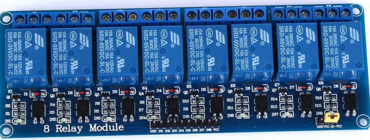

**Kahdeksan releen lauta**

| Rele | GPIO-BCM | Fyysinen pinni |
|---|---|---|
| GND | Ground | 6 tai 9 tai 14 |
| IN1 | GPIO 2 | 3 |
| IN2 | GPIO 3 | 5 |
| IN3 | GPIO 4 | 7 |
| IN4 | GPIO 5 | 29 |
| IN5 | GPIO 6 | 31 |
| IN6 | GPIO 7 | 26 |
| IN7 | GPIO 8 | 28 |
| IN8 | GPIO 9 | 21 |
| VCC | 5V | 2 tai 4 |

Relelaudassa saattaa olla myös erikseen pinnit GND, VCC ja JD-VCC.
*Yhdistä jumpperilla VCC ja JD-VCC*. (Jos ei ole jumpperia, kytke JD-VCC suoraan johonkin 5V pinniin Raspberryssä.)
(Jos käytät pienempää relekorttia, jätä vain ylimääräiset IN-numerot huomiotta).

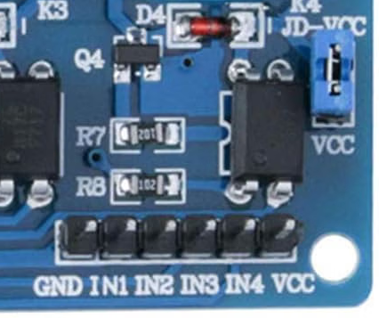

**Neljän releen lauta**

| Rele | GPIO-BCM| Fyysinen pinni |
|---|---|---|
| GND | Ground | 6 tai 9 tai 14 |
| IN1 | GPIO 2 | 3 |
| IN2 | GPIO 3 | 5 |
| IN3 | GPIO 4 | 7 |
| IN4 | GPIO 5 | 29 |
| VCC | 5V | 2 tai 4 |

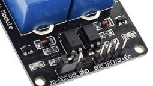

**kahden releen lauta**

| Rele | GPIO-BCM | Fyysinen pinni |
|---|---|---|
| GND | Ground | 6 tai 9 tai 14 |
| IN1 | GPIO 2 | 3 |
| IN2 | GPIO 3 | 5 |
| VCC | 5V | 2 tai 4 |

### Relelogiikka

Tämä koodi on suunniteltu **aktiivi-LOW** -relekorteille, joita myydään yleisesti
Raspberry Pi -projekteihin:

- `GPIO LOW` = rele vetää → sähkölukko avautuu
- `GPIO HIGH` = rele lepotilassa → sähkölukko kiinni

Relekortit ottavat ohjauksensa Raspberry Pi:n GPIO-pinnistä (3.3V/5V).
Sähkölukot kytketään releen kautta 12V akusta. Muista sulakesuojaus!
(Sähkölukoissa yleisesti punainen on + ja musta - )
[Lue lisää kaappien johdotuksesta](kaapit.md)


### Piezo-summeri

Käytä **aktiivista** piezo-summeria. Aktiivisessa summerissa on sisäinen oskillaattori
ja se piippaa pelkällä tasajännitteellä. Passiivinen summeri vaatii PWM-ohjauksen
eikä toimi tässä projektissa.

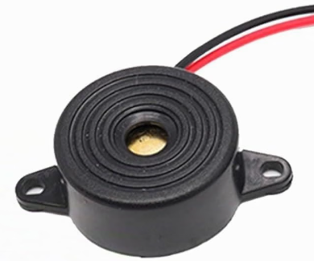


**Aktiivisen piezon** kytkentä:

| Piezo | GPIO-BMC | Fyysinen pinni |
|---|---|---|
| + johto (punainen) | 17 | 11 |
| - johto (musta) | Ground | 6 tai 9 tai 14 |

---

## Toimintaperiaate

Jokainen hylly avataan kerran vuorokaudessa määritettyyn kellonaikaan.
Ennen avautumista piezo-summeri antaa äänimerkkisarjan, joka varoittaa hevosia.

Oletusasetuksilla sekvenssi toimii näin:

```
T-10s  Piippaus 1 (1s)
T-9s   Tauko (1s)
T-8s   Piippaus 2 (1s)
T-7s   Tauko (1s)
T-6s   Piippaus 3 (1s)
T-5s   Tauko (1s)
T-4s   Piippaus 4 (1s)
T-3s   Tauko (1s)
T-2s   Piippaus 5 (1s)
T-1s   Tauko (1s)
T-0s   RELE VETÄÄ 2 sekuntia → hylly avautuu
```

Piippausten määrää, kestoa ja releen vetoaikaa voi muuttaa web-hallintasivulta.

---

## Ohjelmiston asennus

### 1. Valmistele Raspberry Pi

[Asennusopas RPI-sivustolla](https://www.raspberrypi.com/documentation/computers/getting-started.html)

Asenna Raspberry Pi OS (Lite riittää, Desktop toimii myös).
Varmista että SSH on käytössä tai kytke näppäimistö ja näyttö asennuksen ajaksi.

Päivitä järjestelmä:

```bash
sudo apt update && sudo apt upgrade -y
```

### 2. Asenna tarvittavat paketit

```bash
sudo apt install python3 python3-pip python3-venv python3-rpi.gpio -y
```

### 3. Luo hakemisto ja lataa tiedostot

**JOS käytössäsi on git** voit myös ladata koko hakemiston ohjeineen omalle koneellesi yhdellä komennolla:

```bash
cd
git clone https://github.com/JukkaVuola/heinat
```
Lataaminen luo myös ao. hakemistot.
Seuraavia komentoja ei silloin tarvita, siirry kohtaan **4.**

(jatka tästä, jos git ei ole käytössä):

```bash
mkdir -p /home/pi/heinat
cd /home/pi/heinat
```

Kopioi tai lataa repositoriosta seuraavat tiedostot hakemistoon `/home/pi/heinat/`:

- `heina_automaatti.py`
- `config.json`
- `heina-automaatti.service`

### 4. Luo virtuaaliympäristö ja asenna kirjastot

```bash
cd /home/pi/heinat
python3 -m venv .venv
source .venv/bin/activate
pip install flask waitress
deactivate
```

### 5. Muokkaa asetukset

Anna pääskriptille `heina_automaatti.py` suoritusoikeudet:

```bash
chmod 744 /home/pi/heinat/heina_automaatti.py
ls -l /home/pi/heinat/heina_automaatti.py
```
Rivin alussa pitäisi näkyä  **-rwxr--r--**

Avaa `config.json` tekstieditorilla:

```bash
nano /home/pi/heinat/config.json
```

Tarkista ja muuta:
- **GPIO-pinnit** vastaamaan omaa kytkentääsi
- **Avautumisajat** (`"time"`) halutuiksi
- **Käytössä olevat hyllyt** (`"enabled": true/false`)
- **Näkyvyys hallintasivulla** (`"visible": true/false`)

### 6. Asenna systemd-palvelu

```bash
sudo cp /home/pi/heinat/heina-automaatti.service /etc/systemd/system/
sudo systemctl daemon-reload
sudo systemctl enable heina-automaatti.service
sudo systemctl start heina-automaatti.service
```

Tarkista että palvelu käynnistyi:

```bash
sudo systemctl status heina-automaatti.service
```

### 7. Lisää oikeus uudelleenkäynnistykseen hallintasivulta

Jotta palvelun voi käynnistää uudelleen suoraan selaimesta:

```bash
sudo nano /etc/sudoers.d/heina-automaatti
```

Kirjoita tiedostoon täsmälleen tämä rivi:

```
pi ALL=(ALL) NOPASSWD: /bin/systemctl restart heina-automaatti.service
```

Aseta oikeudet ja tarkista syntaksi:

```bash
sudo chmod 440 /etc/sudoers.d/heina-automaatti
sudo visudo -c
```
Jälkimmäinen komento tarkistaa, tulosteen pitäisi näyttää rivi `/etc/sudoers.d/heina-automaatti: parsed OK`.

---

## Yhteys Raspberry Pi:hin

### Vaihtoehto A: Ethernet-kaapeli suoraan (suositeltu)

Tämä tapa ei vaadi WiFiä, tukiasemia eikä internet-yhteyttä.
Toimii aina, myös tallissa ilman verkkoinfrastruktuuria.

**Aseta Raspberry Pi:lle kiinteä IP-osoite:**

```bash
sudo nano /etc/dhcpcd.conf
```

Lisää tiedoston loppuun:

```
interface eth0
static ip_address=192.168.50.1/24
```

**Asenna DHCP-palvelin:**

```bash
sudo apt install dnsmasq -y
sudo nano /etc/dnsmasq.d/heinat.conf
```

Kirjoita:

```
interface=eth0
dhcp-range=192.168.50.10,192.168.50.50,24h
```

Käynnistä palvelu:

```bash
sudo systemctl enable dnsmasq
sudo systemctl restart dnsmasq
sudo reboot
```

**Yhdistä tietokone:** Kytke ethernet-kaapeli. Tietokone saa IP-osoitteen automaattisesti.

Avaa selain ja mene osoitteeseen:
```
http://192.168.50.1:8080/
```

**Valinnainen: lisää helpompi osoite** muokkaamalla tietokoneesi `hosts`-tiedostoa:

- Windows: `C:\Windows\System32\drivers\etc\hosts`
- Linux/macOS: `/etc/hosts`

Lisää rivi:
```
192.168.50.1    heinat.local
```

Tämän jälkeen pääset osoitteella `http://heinat.local:8080/`

### Vaihtoehto B: WiFi-verkko

Jos tallissa on WiFi-verkko, Raspberry Pi löytyy sen kautta normaalisti.
Tarkista Raspberry Pi:n IP-osoite reitittimestä tai komennolla `ip addr`.

---

## Hallintasivun käyttö

Avaa selaimella `http://192.168.50.1:8080/` (tai `http://heinat.local:8080/`)

### Etusivu

**Ajastukset-taulukko:**
- Aseta kullekin hyllylle avautumisaika kellotaulusta napsauttamalla
- Ruksi "Käytössä"-sarakkeeseen ottaa hyllyn käyttöön tai pois
- "Avaa nyt" -nappi käynnistää koko sekvenssin (piippaukset + rele) heti —
  hyödyllinen testaukseen ja poikkeustilanteisiin

**Yleisasetukset:**
- Releen vetoaika (suositus max. 2–3 sekuntia, ettei solenoidi kuumene)
- Piippausten määrä ja kesto

**Tallenna asetukset** -nappi tallentaa muutokset `config.json`-tiedostoon.
Muutokset tulevat voimaan välittömästi ilman uudelleenkäynnistystä —
paitsi `visible`-kenttä, joka vaatii palvelun uudelleenkäynnistyksen.

**Käynnistä palvelu uudelleen** -nappi käynnistää palvelun uudelleen suoraan
selaimesta. Sivu palaa automaattisesti etusivulle muutaman sekunnin kuluttua.

### Lokisivu

Näyttää kaikki tapahtumat aikaleimoineen, uusin ylimpänä.
Lokin voi tyhjentää "Tyhjennä loki" -napilla — ohjelma pyytää varmistuksen.

---

## config.json — asetustiedosto

```json
{
  "shelves": {
    "shelf1": {
      "name": "Alahylly",       <- Näkyvä nimi hallintasivulla
      "pin": 2,                  <- GPIO-pinni (BCM)
      "time": "07:00",           <- Avautumisaika (HH:MM)
      "enabled": true,           <- true = ajastin aktiivinen
      "visible": true            <- true = näkyy hallintasivulla
    },
    ...
  },
  "buzzer_pin": 17,              <- Piezo-summerin GPIO-pinni
  "relay_active_seconds": 2,     <- Releen vetoaika sekunteina
  "buzzer_lead_seconds": 10,     <- Piippausten etuaika sekunteina (automaattinen)
  "beep_on_seconds": 1,          <- Yhden piippauksen kesto
  "beep_off_seconds": 1,         <- Tauko piippausten välissä
  "beep_count": 5                <- Piippausten määrä
}
```

**visible vs. enabled:**
- `enabled: false` — hylly ei avaudu automaattisesti, mutta näkyy hallintasivulla
- `visible: false` — hylly piilotettu hallintasivulta kokonaan,
  mutta toimii ajastimella jos `enabled: true`

---

## Testaaminen ilman Raspberry Pi:tä

Skripti toimii myös tavallisella tietokoneella ilman GPIO-laitteistoa.
Jos `RPi.GPIO`-kirjasto puuttuu, skripti käynnistyy simulointitilassa:
GPIO-kutsuja ei tehdä, mutta web-käyttöliittymä ja ajastuslogiikka toimivat normaalisti.

Tämä mahdollistaa käyttöliittymän testaamisen ennen laitteiston kytkentää.

---

## Vianmääritys

**Palvelu ei käynnisty:**
```bash
journalctl -u heina-automaatti.service -n 50 --no-pager
```
Loki kertoo tarkan virheen.

**Releet eivät toimi:**
- Tarkista GPIO-pinnit `config.json`:sta ja kytkennät
- Varmista että relekortti on aktiivi-LOW -tyyppinen
- Testaa "Avaa nyt" -napilla hallintasivulta

**Piippaukset eivät kuulu:**
- Varmista että käytössä on aktiivinen (ei passiivinen) piezo-summeri
- Tarkista GPIO-pinni 17 `config.json`:sta

**Web-sivu ei aukea:**
- Tarkista että palvelu pyörii: `sudo systemctl status heina-automaatti.service`
- Tarkista ethernet-yhteys ja IP-osoitteet: `ip addr`

**Hylly ei avaudu ajastettuna aikana:**
- Tarkista että `enabled: true` kyseisellä hyllyllä
- Tarkista aikavyöhyke: `timedatectl`
- Katso tapahtumaloki hallintasivulta
- Tarkista, että RPI:n kello on ajassa: `date`
  Aseta tarvittaessa kello oikeaan aikaan, esim: 
```bash
sudo date -s "15 sep 2026 11:27:00"
```
  (Kello saattaa olla väärässä, mikäli RPI ei pääse verkkoon päivittämään aikaa automaattisesti)

---

## Tiedostorakenne

```
heinat/
├── README.md					# Kuvaus ja ohjeistus
├── kaapit.md                   # Kaappien rakennekuvaus
├── heina_automaatti.py         # Pääskripti
├── config.json                 # Asetukset (muokattavissa)
├── heina-automaatti.service    # systemd-palvelutiedosto
├── LICENSE                     # Lisenssi (MIT)
├── kuvat/                      # Kuvakansio
└── .venv/                      # Python-virtuaaliympäristö (luodaan asennuksessa)
```

---

## Lisenssi

MIT License — vapaa käyttää, muokata ja jakaa. Katso [LICENSE](LICENSE).

