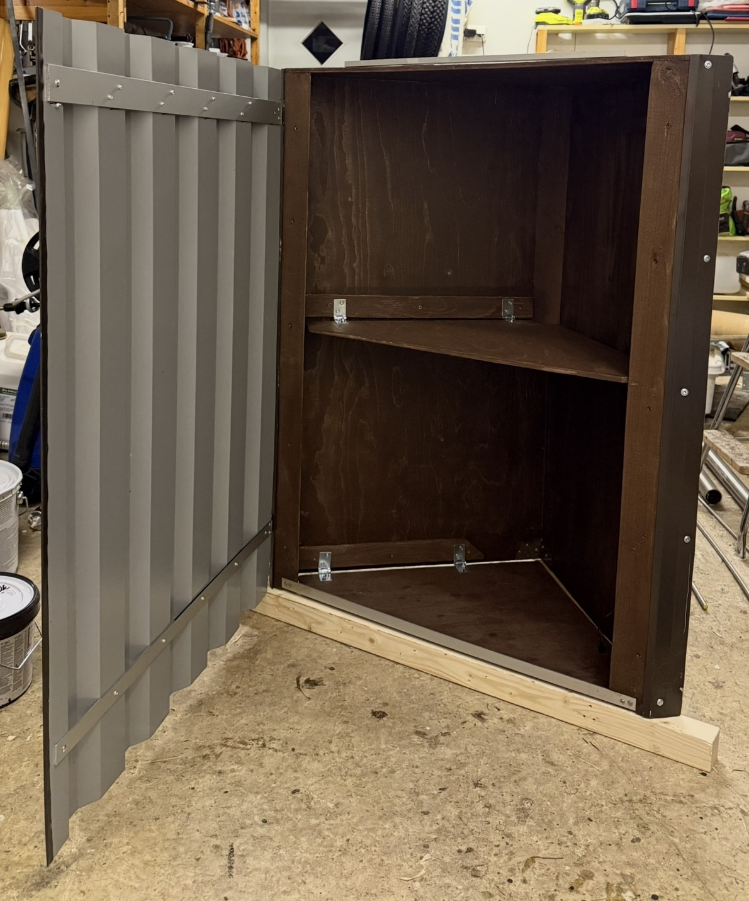
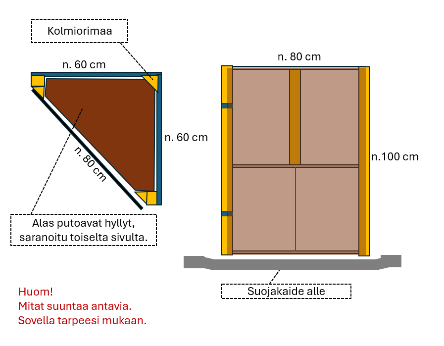
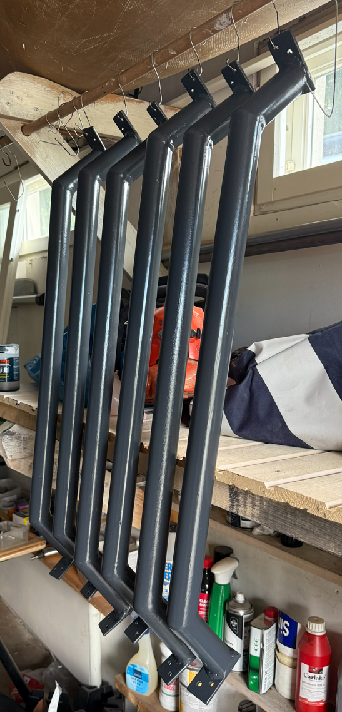
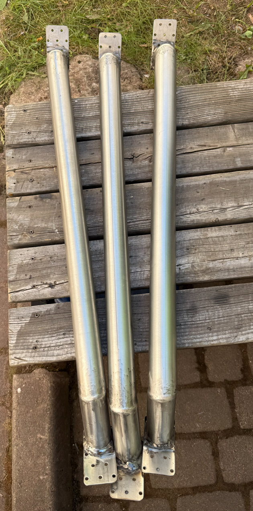
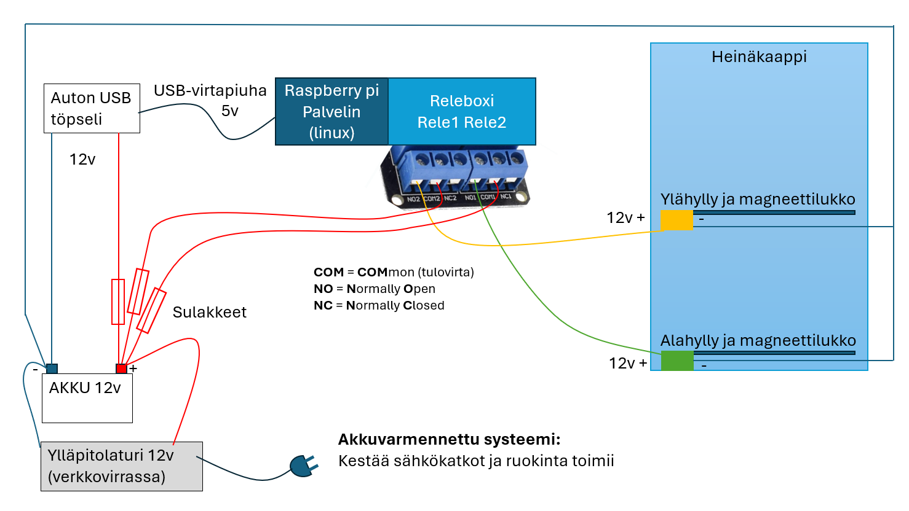
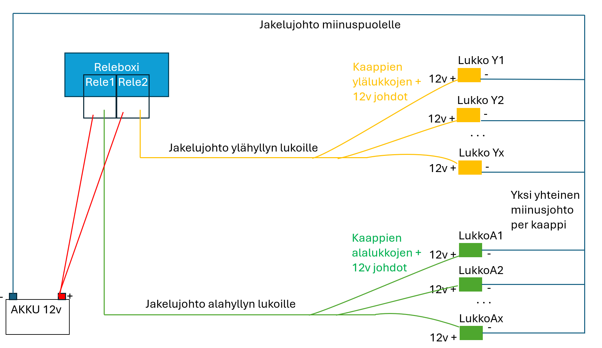
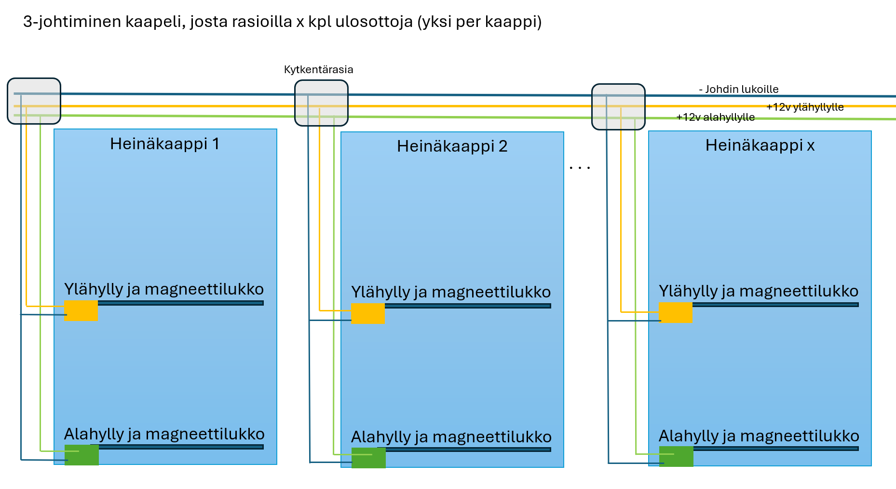
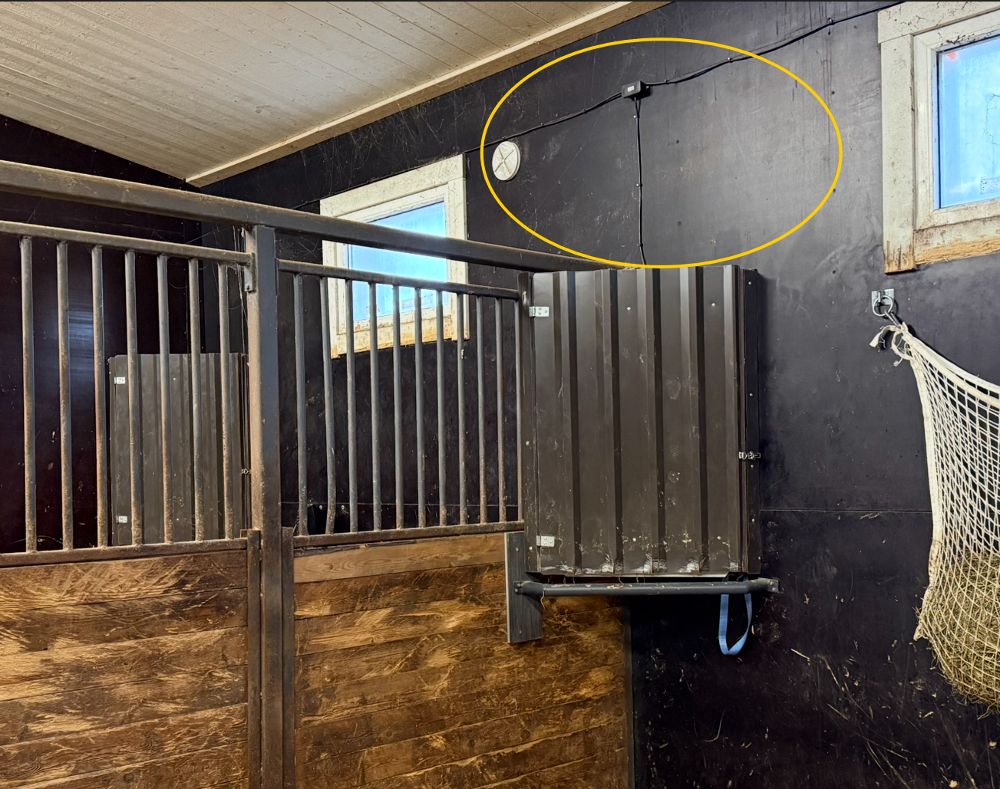

[← Takaisin pääsivulle](README.md)

# Kaappien valmistaminen

---

## Heinäkaapit

Kulmakaapit on valmistettu havuvanerista. Jos takaseinien leveys on max. 60 cm, saa 120 cm leveästä vanerista helposti sopivia paloja. Itse käytin viimeiseen kaappiin 9 mm havuvaneria kaikkeen levytavaraan. Se on suhteellisen edullista eikä homehdu helposti (kuten koivuvanerille saattaa käydä). Varmasti kalliimpi ja aikaa paremmin kestävä vaihtoehto olisi käyttää vesivaneria tai maatilavaneria, mutta havuvanerillakin pärjää hyvin. Myös kaapin katon tein vanerista (hieman upotettuna). 

  
*Heinäkaappi valmistettiin 9 mm vanerista ja ovi kattopellistä*

### Ovet

Ovet tein edullisesta kattopellistä. Pellin leikkaamiseen käytin pientä kulmahiomakonetta, mutta tietysti oikea pellin nakertaja olisi parempi vaihtoehto. Reunojen epätasaisuuden pitää hioa pois ja mielellään suojata maalilla. Oven salpapuolen taitoin kahden puunriman välissä kaksinkerroin. Puristimilla tukevasti pelti kahden riman väliin tarkasti ja kumivasaralla naputtelee taitteen. Toimi yllättävän hyvin ja helposti.

Alkuun laitoin ovien jäykisteeksi 3 cm leveää lattarautaa, mutta myöhemmin alumiinista lattaa (jota ei tarvitse erikseen pintakäsitellä). Kokoa 3 mm x 40 mm oven yläreunaan ja 3 mm x 25 mm alareunaan.

### Kaappien mitat
 
Kaapit ovat kulmakaappeja
- korkeus 100 cm
- takaseinien pituus n. voisi olla 57 - 60 cm
- takakulman tueksi 50 mm x 50 mm kolmiorimaa n. 50 cm korkea pätkä
- kaapin ovireunat 50 mm x 50 mm neliörimaa ("kakkos kakkosta") ja siihen liimattuna em. kolmiorimaa, pituus 99 cm (koska kolmion muotoinen katto upotetaan hieman).
- kaappien hyllyt suoraan vaneriin sitten, kun runko oli valmis käyttäen runkoa piirtomuottina

*Kaapin mitat ovat suuntaa antavia - sovella tarpeesi mukaan*

### Suojapellit
Periaatteessa kaikki puuosat on suojattava pellillä, sillä monille hevosille paljas puu on suoranaista herkkua nakerrella. Pelti estää nakertelun tehokkaasti (vaikka jotkut näköjään nakertelevat myös peltiä heinän toivossa). Peltejä tarvitaan lähinnä oven molemmin puolin.
Leikkasin suojapellit kattopellin ylijäämästä. Edullinen ja toimiva ratkaisu, mutta työläs, koska reunat pitää taas hioa siisteiksi.

## Suojakaiteet heinäkaapeille
Suojakaiteet ovat välttämättömät. Ne suojaavat kaappeja kolhuilta ja painumiselta, jos hevoset sattuvat nojailemaan kaappeja vasten. 
Ne suojaavat myös kaapin alta syövää hevosta, jos hevonen esim. pelästyy ja nostaa nopeasti päätään. Vaarana on peltisen oven reuna, joka voi leikata haavan hevosen päähän. 
Itse hitsasin suojakaiteet tavallisesta putkesta ja maalasin ne. Maalattu putki kuitenkin naarmuuntuu kuolaantuu helposti, jos hevonen naarmuttaa sitä hampaillaan. Sitten kaide alkaa ruostua. Näin kävi käytännössä. 

*Maalattuja raudasta tehtyjä suojakaiteita*

Ensiapuna hitsasin uusia kaiteita ruostumattomasta putkesta. Amatöörihitsarille ruostumattoman pyöreän putken hitsaaminen on haastavaa.
(Vaihtoehtoina ovat ruostumaton puikkohitsaus, MIG-hitsaus ruostumattomalla langalla ja Argon kaasulla tai TIG-hitsaus ruostumattomalla langalla ja Argon kaasulla. Itse käytin MIG-hitsausta). Ruostumattomat laipat tein ruostumattomista naulauslevyistä, mikä helpotti työtä hieman (reiät valmiina ja kokokin melko oikea)

*RST-putkesta tehtyjä suojakaiteita*

Helpoin ratkaisu olisi hitsata kestävät suojakaiteet ruostumattomasta neliöputkesta, jota on helpompi leikata määrättyyn kulmaan ja hitsaaminenkin on yksinkertaisempaa. Suosittelen siis tällaista myös itselleni, jos vielä tarvetta tulee.

### Muita tarvikkeita
- jokaiseen hyllyyn 2 saranaa
- kaapin oveen jonkinlainen tukeva salpa 
- ruuveja sekä kosteudenkestävää puuliimaa

--- 

## Työstö
- vaneria sahailin käsisahalla ja pöytäsirkkelillä
- kattopeltiä työstin useaa peltiä kerralla (päällekkäin) pienellä kulmahiomakoneella ja viimeistelin viilalla ja hiomapaperilla
- rautamaalia pensselillä
- kaappien sisustan käsittelin kaapista löytyneellä saunavahalla, ulko-osia maalailin
- ruuvinväännin ja poranterät olivat ahkerassa käytössä
- oviin saranat kiinnitin alumiinisilla pop-niiteillä ja runkoon ruuveilla
- jäykisteetkin kiinnitin pop-niiteillä 

--- 

## Tarvikkeiden hankintapaikat

Itse käyttämiäni hankintapaikkoja:

| Komponentti | linkki |
|---|---|
| Alumiinilatta 40 mm | [Puuilon Warma-lattalista 40 mm] (https://www.puuilo.fi/warma-lattalista-alumiini-3x40mm-2m) |
| Alumiinilatta 25 mm | [Puuilon Warma-lattalista 25 mm] (https://www.puuilo.fi/warma-lattalista-alumiini-3x25mm-2m) |
| Kattopelti oviin | [Hammeri.fi kattopeltiä] (https://www.hammer.fi/s/search/?keywords=kattopelti) |
| Puuosat | [Stark-Suomi noutopihalta] (https://www.stark-suomi.fi/) |

--- 

## Kaappien 12V sähkökytkennät

12V sähkötyöt eivät ole luvanvaraisia, joten nekin voi tehdä itse, jos osaa.
Tässä muutama kuva vihjeeksi, miten johdotus on mahdollista tehdä.

*Periaatekuva, johdotus 12V akulta sulakkeiden kautta lukoille*

--- 

*Yksi rele ohjaa yhtä +12V jännitettä yhdelle hyllytasolle, miinusjohto yhteinen kaikille hyllytasoa*

---

*Kaappeja voi ketjuttaa useita - johtojen määrä kaapelissa riippuu hyllytasojen määrästä*
- periaatteessa hyllytasojen määrä + 1 kpl miinusjohtoja = tarvittava johdinten määrä kaapelin sisällä

---

*Tässä kuvassa näkyy tallin seinällä musta 12V kaapeli, kytkentärasia ja alasvienti kaapille*

---

[← Takaisin pääsivulle](README.md)